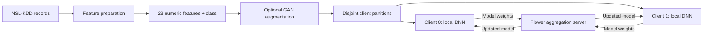

# Federated Learning for Network Intrusion Detection

A capstone research project exploring **network intrusion detection on NSL-KDD** using a deep neural network, federated training with Flower, and GAN-based augmentation of underrepresented attack classes.

The project brings together three questions: how to classify network attacks, how to train a shared model across clients, and how synthetic data might help with severe class imbalance.

**Python · TensorFlow / Keras · Flower · pandas · scikit-learn · NSL-KDD**

## Architecture



The local demonstration partitions one prepared CSV across processes. Flower exchanges model parameters and evaluation metrics. This experiment does not implement differential privacy, secure aggregation, or a production network sensor.

## What's included

| Component | Purpose |
| --- | --- |
| `client.py` | Configurable local training client with repeatable, disjoint train/validation partitions |
| `server.py` | Flower server with the original experimental momentum rule and a FedAvg comparison option |
| `model.py` | Original DNN: **23 → 512 → 256 → 256 → 128 → 64 → 5**, ReLU, dropout, softmax |
| `notebooks/clientmk3i.ipynb` | Exploratory data analysis and preprocessing experiments |
| `notebooks/data_aug.ipynb` | GAN augmentation experiments for minority classes |
| `notebooks/data_aug_exp.ipynb` | Alternative GAN architecture |
| `notebooks/clientdnn_confustion.ipynb` | Centralized DNN training and confusion-matrix plotting |
| `experiments/` | Earlier capstone scripts retained for research context |
| `tests/` | Checks for partition isolation, repeatability, and label validation |

## Run locally

Use **Python 3.9–3.11**. Dependencies target the older Flower/Keras APIs used by the project.

```bash
git clone https://github.com/Suhail15/Federated-Learning-NIDS.git
cd Federated-Learning-NIDS
python3 -m venv .venv
source .venv/bin/activate
python -m pip install -r requirements.txt
```

On Windows, activate with `.venv\Scripts\activate`.

Place the prepared capstone dataset at `data/df_aug_shuff_c1.csv`. **Datasets and model checkpoints are not included in Git.** See [the data guide](data/README.md) for the expected schema, dataset provenance, and existing-data setup. Raw NSL-KDD files cannot be passed directly to the client.

Start a server in one terminal:

```bash
python server.py --num-clients 2 --rounds 5 --epochs 10
```

In two additional terminals, activate the same environment and launch one client in each:

```bash
python client.py --client-id 0 --num-clients 2
python client.py --client-id 1 --num-clients 2
```

The server waits for both clients. Every client must use the **same CSV, seed, and client count**, with a unique client ID. Each client reserves 20% of its own partition for validation. Use `--data /path/to/prepared.csv` to select another prepared file.

For a short run, use `--rounds 1 --epochs 1`. For a standard FedAvg comparison, add `--strategy fedavg` to the server command. Four-client runs use `--num-clients 4` everywhere and IDs `0`, `1`, `2`, `3`.

## Data and class imbalance

The local prepared files contain these class counts; these are **dataset statistics, not model performance results**:

| Label | Class | Before augmentation | Augmented CSV |
| --- | --- | ---: | ---: |
| 0 | Normal | 67,343 | 67,343 |
| 1 | Denial of Service (DoS) | 45,927 | 45,927 |
| 2 | Probe | 11,656 | 45,927 |
| 3 | Remote to Local (R2L) | 995 | 45,927 |
| 4 | User to Root (U2R) | 52 | 45,927 |

The GAN notebook trains a generator and discriminator and generates additional samples for classes 2–4. The final CSV retains more normal examples than any individual attack class.

## Research notes

- **Experimental aggregation:** the original server adds an exponential moving average of the aggregated weights to those weights. `server.py` preserves this rule as `capstone-momentum`; it is not a claim to implement standard FedAvgM. The default coefficient is 0.9.
- **Evaluation scope:** client accuracy is local validation accuracy, aggregated by validation sample count. It is not official NSL-KDD test-set accuracy. No benchmark accuracy is claimed here.
- **Augmentation leakage:** the historical augmented CSV was generated before the client validation split. A rigorous study must split original records before fitting preprocessing or training a GAN, then evaluate on untouched real records.
- **Historical notebooks:** preprocessing experiments include both binary and multiclass work and are not a single verified, end-to-end recipe for rebuilding the supplied five-class CSV. Some notebook cells require intermediate files or manual path adjustments. See [notebook notes](notebooks/README.md).
- **Packaging changes:** the portable entry points reuse the capstone DNN and aggregation rule, add command-line configuration and input validation, and correct client partition overlap and dropped-remainder risks. Historical scripts are kept separately; notebook outputs were cleared before publication.

## Checks

Validated on macOS ARM64 / Python 3.9: all three partition/input tests pass, all Python scripts compile, and two clients completed one training/evaluation round on a 1,000-row sample of the local augmented CSV with zero client failures. This is a functional smoke test, not a full training run or a benchmark.

```bash
python -m unittest discover -s tests -v
python -m compileall -q client.py server.py model.py data.py experiments
```

## References

- [NSL-KDD — Canadian Institute for Cybersecurity, University of New Brunswick](https://www.unb.ca/cic/datasets/nsl.html)
- [Flower 1.8.0](https://pypi.org/project/flwr/1.8.0/)
- [TensorFlow 2.15.1](https://pypi.org/project/tensorflow/2.15.1/)

Capstone project by [Suhail Hussain](https://github.com/Suhail15).
