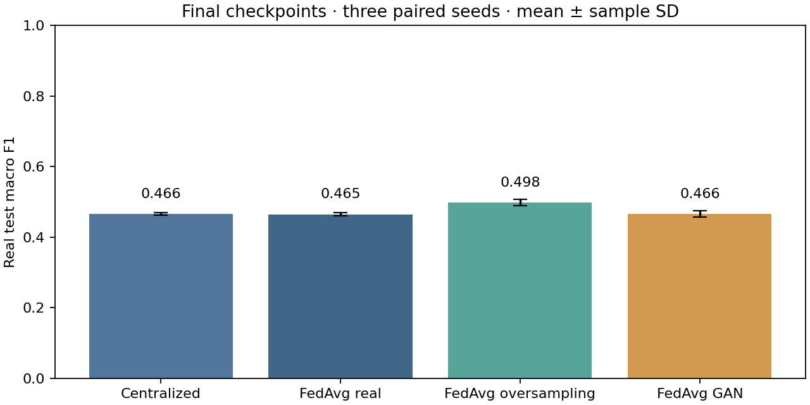
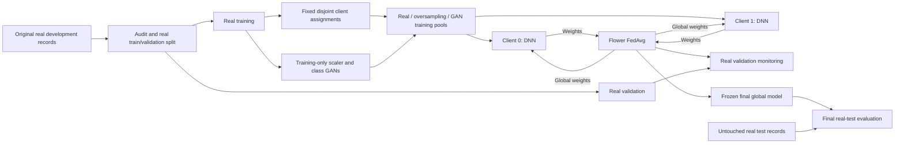

# Federated Learning for Network Intrusion Detection

**An NSL-KDD capstone combining a five-class neural classifier, Flower federated training, and GAN augmentation experiments.**

Network intrusion detection has two challenges explored here: learning from records distributed across clients and recognising attack classes with very few examples. This project implements a local federated training workflow and investigates synthetic minority-class data. It now includes a controlled benchmark with original-record splits, training-only augmentation, and held-out real-record evaluation. Ordinary oversampling outperformed GAN augmentation on macro F1 in all three paired seeds; the experimental aggregation rule remains untested.

**Python · TensorFlow / Keras · Flower · pandas · scikit-learn · NSL-KDD**

Capstone by [Suhail Hussain](https://github.com/Suhail15) · Status: research prototype with measured benchmark evidence

[Evidence](#evidence-and-validation) · [Architecture](#architecture) · [Run benchmark](benchmark/README.md) · [Limitations](#limitations-and-evaluation-boundaries) · [Benchmark protocol](docs/benchmark-protocol.md) · [Results and full evidence](results/benchmark/nsl-kdd-v1/report.md) · [GAN investigation](docs/gan-findings.md)

## Project at a glance

| Question | Implementation | What is established |
| --- | --- | --- |
| Can clients train a shared intrusion classifier? | Flower clients train a Keras DNN on disjoint partitions of one prepared CSV | Historical network smoke test plus a new five-round, two-client benchmark using Flower aggregation |
| How is class imbalance explored? | GAN notebooks generate samples for Probe, R2L, and U2R | GAN is compared with real-only training and matched random oversampling; no consistent GAN advantage observed |
| How are aggregation approaches exposed? | Standard FedAvg option alongside the original capstone momentum rule | Both options exist in code; no comparative performance claim |

## Engineering work demonstrated

- **Model integration:** a 23-feature, five-class DNN connected to Flower client training and server aggregation.
- **Data integrity:** deterministic client partitions, input validation, and tests for overlap, coverage, and train/validation separation.
- **Portable execution:** configurable entry points replace machine-specific paths and address overlapping partitions and dropped remainder rows in the historical workflow.
- **Research judgement:** explicit separation of workflow validation, dataset statistics, and model performance, including the historical GAN leakage issue.

## Evidence and validation

Historical smoke and current benchmark environment: **macOS ARM64 / Python 3.9**.

| Evidence | Verified result | Scope |
| --- | --- | --- |
| Automated checks | **15/15 passed** (includes the original 3 checks) | Covers partitions, duplicate-group isolation, scaler-fit provenance, held-out exclusion, parser/metrics, subtype boundaries, capped GAN doses and balanced class exposure |
| Python compilation | All Python scripts compiled successfully | Syntax validation only |
| Federated smoke test | **2 clients**, **1 training/evaluation round**, **1,000 sampled rows**, **0 client failures** | Confirms the local training/evaluation workflow completes; not a full training run or benchmark |
| Dataset statistics | Before/after class counts are reported [below](#data-and-class-imbalance) | Describes class imbalance and augmentation volume, not detection quality |
| New held-out benchmark | **12 DNN runs + 9 independent class-GAN fits completed** | Four configurations, three paired seeds, five rounds; evaluated on all 22,544 locally held KDDTest+ records after freezing checkpoints |
| Independent evidence verification | **All 12 runs passed** | Metrics recomputed from saved predictions; complete test coverage, initial-weight pairing, update budgets and fit/oversampling provenance checked |
| Conditional GAN investigation | **30 DNN runs + 6 CTGAN fits completed** | Two bounded development-only studies; capped doses and matched controls across the same three seeds; neither study establishes a GAN advantage |

The historical smoke test used the augmented-before-split CSV and remains workflow evidence only. The new benchmark rebuilds preparation from raw records and separates real training/validation before fitting the scaler or GANs. Saved predictions, logs, hashes, class metrics and charts support the new measurements.

**Scope:** the original acquisition source of the local raw files is unrecorded; exact hashes, explicit attack taxonomy and exclusions are documented. The benchmark uses serial clients in one process with actual Flower FedAvg aggregation and pooled training-only GAN preparation. It does not establish private-silo training, network transport performance, production readiness or capstone-momentum benefit.

Re-run the automated checks:

```bash
python -m unittest discover -s tests -v
python -m compileall -q client.py server.py model.py data.py experiments
```

## Controlled benchmark results

Measured on **22,544 real test records**, with no test-based checkpoint or hyperparameter selection. Values are mean ± sample standard deviation across seeds 11, 22 and 33.

| Configuration | Test macro F1 | Test accuracy | Normal false-positive rate |
| --- | ---: | ---: | ---: |
| Centralized DNN, real only | 0.4658 ± 0.0038 | 0.7472 ± 0.0092 | 0.0657 ± 0.0070 |
| FedAvg, real only | 0.4647 ± 0.0039 | 0.7438 ± 0.0031 | 0.0582 ± 0.0112 |
| FedAvg, random oversampling | 0.4978 ± 0.0094 | 0.7427 ± 0.0009 | 0.0823 ± 0.0038 |
| FedAvg, GAN augmentation | 0.4662 ± 0.0091 | 0.7387 ± 0.0044 | 0.0688 ± 0.0023 |

**Finding:** GAN minus real-only macro F1 was +0.0015 ± 0.0125, with mixed signs across seeds. GAN minus oversampling was −0.0316 ± 0.0002, negative in all three seeds. This experiment supports no consistent GAN advantage. Oversampling improves macro F1 here at a higher normal false-positive rate. R2L/U2R detection remains weak; overall accuracy should not hide that limitation.



[Full results, limitations and downloadable evidence](results/benchmark/nsl-kdd-v1/report.md) · [Independent verification](results/benchmark/nsl-kdd-v1/independent-verification.json) · [Reproduce the benchmark](benchmark/README.md)

Initial/final models and generated feature pools are retained outside Git. The downloadable evidence archive contains full split IDs, GAN fit IDs, oversampling lineage and per-record predictions; no raw feature records or model weights.

## Investigating a better GAN recipe

A separate [conditional GAN investigation](docs/gan-findings.md) tests mixed-type generation, smaller synthetic doses and family-balanced GAN fitting. All new fits exclude entire held-out attack subtypes; the original benchmark test set stays closed. On the development subtype challenge, CTGAN +25% scored **0.3630 ± 0.0071** macro F1 versus **0.3891 ± 0.0083** for matched oversampling. Rebalancing GAN fitting improved some generation diagnostics but did not improve detection; both doses and both attempts are published.

The [training-only feature audit](results/gan-research/feature-audit.json) identifies omitted failed-login and root-shell fields as a concrete next hypothesis. Restoring those fields and testing whether GAN adds value beyond the expanded real-data model is **not yet run**. The reused validation and seven-record U2R challenge cannot establish fresh generalization.

## Architecture



The benchmark above fixes the leakage boundary. Its clients execute serially in process and Flower performs model aggregation; training-fitted transforms are reused for evaluation. The historical demo below uses separate local processes and one prepared CSV. Neither implements differential privacy, secure aggregation, or a production network sensor.

## What's included

| Component | Purpose |
| --- | --- |
| `benchmark/` | Raw preparation, independent class GANs, paired controls, frozen global checkpoints, held-out evaluation and evidence exports |
| `results/benchmark/nsl-kdd-v1/` | Measured results, plots, logs, provenance and downloadable full evidence tables |
| `gan_research/` | Optional CTGAN pilots with capped doses, subtype holdouts, balanced controls and training-only fit provenance |
| `results/gan-research/` | Both exploratory outcomes, family metrics, generation diagnostics, feature audit and exact evidence archives |
| `client.py` | Configurable local training client with repeatable, disjoint train/validation partitions |
| `server.py` | Flower server with the original experimental momentum rule and a FedAvg comparison option |
| `model.py` | Original DNN: **23 → 512 → 256 → 256 → 128 → 64 → 5**, ReLU, dropout, softmax |
| `notebooks/clientmk3i.ipynb` | Exploratory data analysis and preprocessing experiments |
| `notebooks/data_aug.ipynb` | GAN augmentation experiments for minority classes |
| `notebooks/data_aug_exp.ipynb` | Alternative GAN architecture |
| `notebooks/clientdnn_confustion.ipynb` | Centralized DNN training and confusion-matrix plotting |
| `experiments/` | Earlier capstone scripts retained for research context |
| `tests/` | Checks for partition isolation, repeatability, and label validation |

## Data and class imbalance

The historical prepared files contain these class counts; these are **dataset statistics, not model performance results**:

| Label | Class | Before augmentation | Augmented CSV |
| --- | --- | ---: | ---: |
| 0 | Normal | 67,343 | 67,343 |
| 1 | Denial of Service (DoS) | 45,927 | 45,927 |
| 2 | Probe | 11,656 | 45,927 |
| 3 | Remote to Local (R2L) | 995 | 45,927 |
| 4 | User to Root (U2R) | 52 | 45,927 |

The GAN notebook trains a generator and discriminator and generates additional samples for classes 2–4. The final CSV retains more normal examples than any individual attack class.

## Limitations and evaluation boundaries

- **Experimental aggregation:** the original server adds an exponential moving average of the aggregated weights to those weights. `server.py` preserves this rule as `capstone-momentum`; it is not a claim to implement standard FedAvgM. The default coefficient is 0.9.
- **Evaluation scope:** historical client accuracy is local validation accuracy. New scores come from the final global models on the complete locally held real test file; acquisition provenance and taxonomy limits are explicit in the report.
- **Augmentation leakage:** the historical augmented CSV was generated before the client validation split. The separate benchmark implements this ordering and evaluates on real held-out records; historical smoke scores are not reused.
- **Historical notebooks:** preprocessing experiments include both binary and multiclass work and are not a single verified, end-to-end recipe for rebuilding the supplied five-class CSV. Some notebook cells require intermediate files or manual path adjustments. See [notebook notes](notebooks/README.md).
- **Packaging changes:** the portable entry points reuse the capstone DNN and aggregation rule, add command-line configuration and input validation, and correct client partition overlap and dropped-remainder risks. Historical scripts are kept separately; notebook outputs were cleared before publication.

## Run the historical local demo

For the controlled benchmark, follow [the benchmark commands](benchmark/README.md); its split manifests and evaluator are separate from this historical demonstration.

Use **Python 3.9–3.11**. Dependencies target the older Flower/Keras APIs used by the project.

```bash
git clone https://github.com/Suhail15/Federated-Learning-NIDS.git
cd Federated-Learning-NIDS
python3 -m venv .venv
source .venv/bin/activate
python -m pip install -r requirements.txt
```

On Windows, activate with `.venv\Scripts\activate`.

Place the prepared capstone dataset at `data/df_aug_shuff_c1.csv`. **Datasets and model checkpoints are not included in Git.** See [the data guide](data/README.md) for the expected schema, dataset provenance, and existing-data setup. Raw NSL-KDD files cannot be passed directly to the client.

Start a server in one terminal:

```bash
python server.py --num-clients 2 --rounds 5 --epochs 10
```

In two additional terminals, activate the same environment and launch one client in each:

```bash
python client.py --client-id 0 --num-clients 2
python client.py --client-id 1 --num-clients 2
```

The server waits for both clients. Every client must use the **same CSV, seed, and client count**, with a unique client ID. Each client reserves 20% of its own partition for validation. Use `--data /path/to/prepared.csv` to select another prepared file.

For a short run, use `--rounds 1 --epochs 1`. For a standard FedAvg comparison, add `--strategy fedavg` to the server command. Four-client runs use `--num-clients 4` everywhere and IDs `0`, `1`, `2`, `3`.

## References

- [NSL-KDD — Canadian Institute for Cybersecurity, University of New Brunswick](https://www.unb.ca/cic/datasets/nsl.html)
- [Flower 1.8.0](https://pypi.org/project/flwr/1.8.0/)
- [TensorFlow 2.15.1](https://pypi.org/project/tensorflow/2.15.1/)

Capstone project by [Suhail Hussain](https://github.com/Suhail15).
