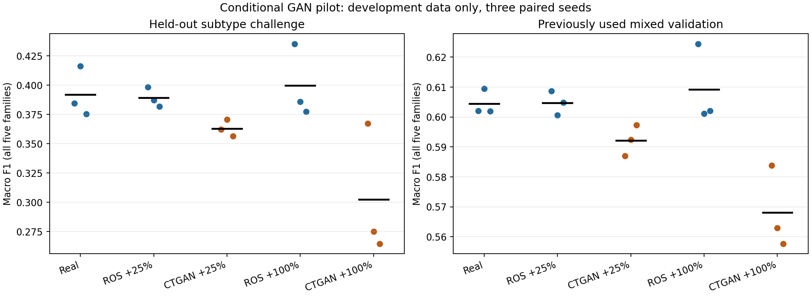

# Conditional GAN validation pilot

**Exploratory development results. KDDTest+ was not read or re-evaluated.**

The original GAN gained on ordinary validation without transferring that gain to the v1 test set. This pilot tests a shared conditional tabular GAN, a capped dose, and class-balanced batches. All controls use the same batches by family, initial weights, final-round checkpoint rule and update budget.

## Protocol and boundaries

- Core real training: **96,481** rows; class counts [53784, 35672, 6910, 81, 34].
- Entire `back`, `portsweep`, `warezclient`, `loadmodule` subtypes are excluded from the new training and scaler/GAN fits. The challenge combines those held-out records with original validation normals: counts [13446, 734, 2310, 715, 7].
- Mixed validation: 25,062 original v1 validation records. Its normal records also appear in the challenge; the two panels are not independent.
- One scaler is refitted on core real training only. One CTGAN per seed jointly fits core Probe/R2L/U2R records, with family and binary features treated as discrete. Sampling is filtered by actual output family, projected to valid domains, and exact core/generated patterns rejected using training data only.
- Synthetic doses are 25% and 100% of each client's real minority-family count (rounded up), with matched client-only ROS. Balanced batches already repeat rare real records in every control; augmentation must improve on that stronger baseline.
- Two serial in-process Flower FedAvg clients; 5 rounds; batch 128; [405, 405] updates/client/round; **4,050 updates/run**; three seeds; 15 DNN runs and 3 CTGAN fits.
- Final checkpoints for all treatments were frozen before these scores. No evaluation-based filtering or checkpoint selection.
- **These are not fresh independent test sets:** mixed validation was scored before; held-out subtype records were in v1 training. Subtype selection and this design follow inspection of prior results. Treat gains as hypotheses, not confirmed generalization.
- Only **7 U2R challenge records**. The altered class mix makes macro F1 incomparable with v1 test F1. Seed standard deviations describe optimization variation, not statistical confidence or dataset-sampling uncertainty.
- Full 41-feature groups are disjoint, but reduced 23-feature overlap is {'core_challenge': 1708, 'core_mixed_validation': 3361}. This is not an exclusively novel-input benchmark.
- Raw acquisition provenance remains unrecorded. Pooled preparation provides no private-silo, secure aggregation or privacy guarantee.

## Measured results

### subtype-challenge

| Treatment | Macro F1, mean ± SD | Balanced accuracy | Normal FPR |
| --- | ---: | ---: | ---: |
| Balanced real only | 0.3921 ± 0.0215 | 0.4999 | 0.0519 |
| Balanced ROS +25% | 0.3891 ± 0.0083 | 0.4975 | 0.0508 |
| Balanced CTGAN +25% | 0.3630 ± 0.0071 | 0.4681 | 0.0580 |
| Balanced ROS +100% | 0.3996 ± 0.0312 | 0.5072 | 0.0531 |
| Balanced CTGAN +100% | 0.3024 ± 0.0565 | 0.3916 | 0.0660 |

### mixed-validation

| Treatment | Macro F1, mean ± SD | Balanced accuracy | Normal FPR |
| --- | ---: | ---: | ---: |
| Balanced real only | 0.6045 ± 0.0043 | 0.7397 | 0.0519 |
| Balanced ROS +25% | 0.6047 ± 0.0040 | 0.7386 | 0.0508 |
| Balanced CTGAN +25% | 0.5922 ± 0.0052 | 0.7283 | 0.0580 |
| Balanced ROS +100% | 0.6092 ± 0.0132 | 0.7454 | 0.0531 |
| Balanced CTGAN +100% | 0.5681 ± 0.0138 | 0.7016 | 0.0660 |

## Paired GAN evidence

| Dose | Control | Challenge F1 difference, mean ± SD | Positive seeds | Mixed F1 difference | Passes pilot rule |
| --- | --- | ---: | ---: | ---: | --- |
| 25% | Balanced real only | -0.0291 ± 0.0145 | 0/3 | -0.0123 | False |
| 25% | Balanced ROS +25% | -0.0261 ± 0.0098 | 0/3 | -0.0125 | False |
| 100% | Balanced real only | -0.0897 ± 0.0646 | 0/3 | -0.0364 | False |
| 100% | Balanced ROS +100% | -0.0971 ± 0.0253 | 0/3 | -0.0411 | False |

**Finding:** Neither dose met the predeclared pilot rule. This pilot does not establish a reliable GAN advantage.

The rule required at least +0.01 mean challenge macro F1 versus both real-only and matched-dose ROS, positive differences in at least two seeds per control, no more than +0.01 mean normal FPR, and no more than 0.01 mixed-validation F1 loss. It is an exploratory decision rule, not a significance test. Both doses are reported; no hidden sweep.

## Evidence and next decision

- [Locked plan](plan.json), [summary](summary.csv), [all family metrics](per-class.csv), [paired differences and decision](comparison.json), [independent verification](verification.json).
- Each augmentation folder records training-fit IDs, losses, conditional-sampling rejections, projection counts and training-only feature-distribution diagnostics. Diagnostics check resemblance and validity; they do not establish detection benefit or privacy.
- Run folders contain training losses, paired label-schedule hashes, environment versions, model/input hashes, family metrics and complete real-record probabilities. Initial/final weights and synthetic feature pools remain outside Git.
- Confirmation requires a separately selected, provenance-verified real evaluation source, mapped to a locked taxonomy and comparable feature schema. Freeze the candidate before examining that data. Do not keep optimizing against the already scored v1 test set.
- If no candidate improves the controls, retain real-only/oversampling as the supported choices and investigate more real rare-attack coverage or richer features. GAN samples cannot restore attack patterns absent from the underlying observations.

## Download exact evidence tables

[Evidence archive](evidence-tables.tar.gz) contains all 23 exact split, fit, lineage and prediction tables. [Artifact index](artifacts.json) records each member's hash and the archive hash. Extract into this directory before rerunning verification. No raw features, generated records or models are included.
